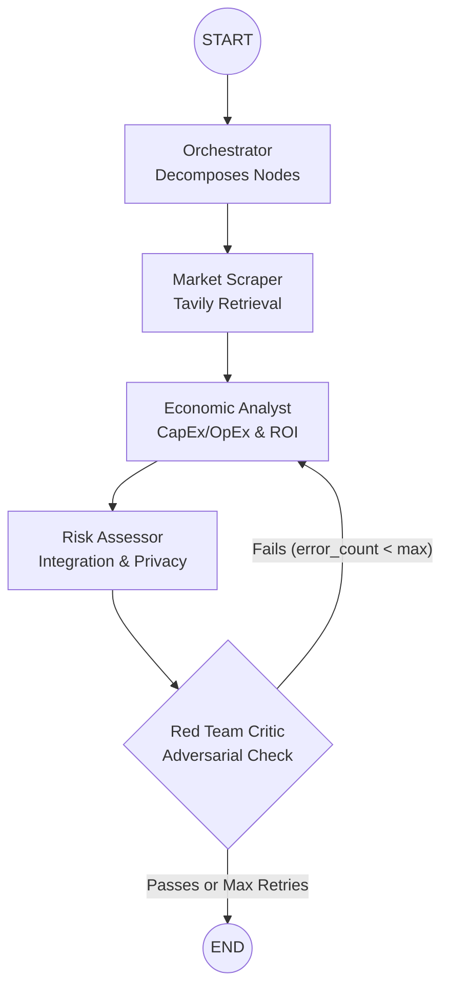

# GCPL AI Intern Hackathon Submission: Option A

## Overview
This repository contains the official submission for Option A: Multi-Agent Research Assistant. The primary focus of this system is to maintain high microeconomic rigor and perform thorough enterprise risk assessment. It features an adversarial reflection loop specifically designed to filter out Large Language Model (LLM) hallucinations, ensuring reliable, enterprise-grade outputs.

## System Architecture



## Repository Structure
```text
.
├── assets/
│   └── architecture.png
├── config/
│   └── settings.py
├── docs/
│   ├── 01_Problem_Approach.md
│   ├── 02_Architecture_Data_Flow.md
│   ├── 03_Technology_Choices.md
│   └── 04_Evaluation_and_Limitations.md
├── src/
│   ├── agents/
│   ├── core/
│   ├── ui/
│   │   └── app.py
│   └── utils/
├── .env.example
├── README.md
└── requirements.txt
```

## Documentation Library
* [Problem Approach](docs/01_Problem_Approach.md): Details the specific supply chain bottlenecks addressed and the analytical framework applied.
* [Architecture and Data Flow](docs/02_Architecture_Data_Flow.md): Explains the cyclic LangGraph setup, the roles of the five distinct agents, and the specific state management implementation.
* [Technology Choices](docs/03_Technology_Choices.md): Outlines the structural trade-offs, frameworks, APIs, and specific configurations chosen for the system.
* [Evaluation and Limitations](docs/04_Evaluation_and_Limitations.md): Covers testing outcomes, known constraints regarding context window limits, and future improvement vectors.

## Quick Start
```bash
pip install -r requirements.txt
cp .env.example .env
streamlit run src/ui/app.py
```

## About the Author
Sarthak Somani is a second-year undergraduate student at IIT Bombay, pursuing a major in Economics and a minor in Data Science. With a strong interest in the intersection of microeconomics, artificial intelligence, and public policy, Sarthak focuses on building analytical, data-driven frameworks to solve complex enterprise bottlenecks. He serves as a Convenor at the Web and Coding Club (WnCC).
