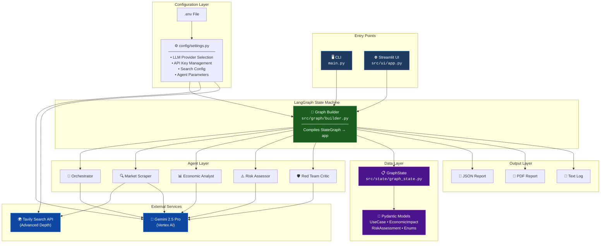
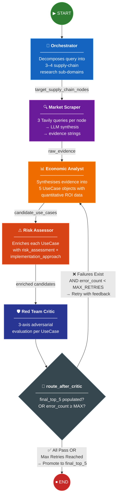
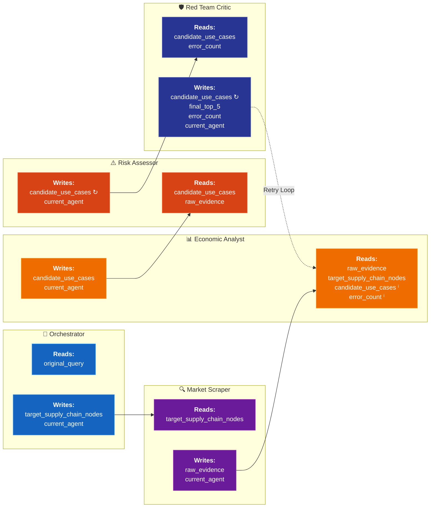
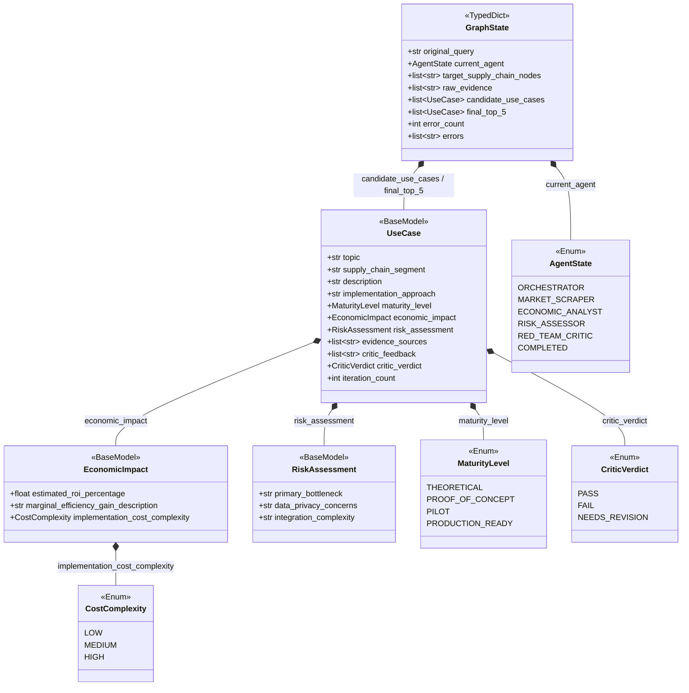
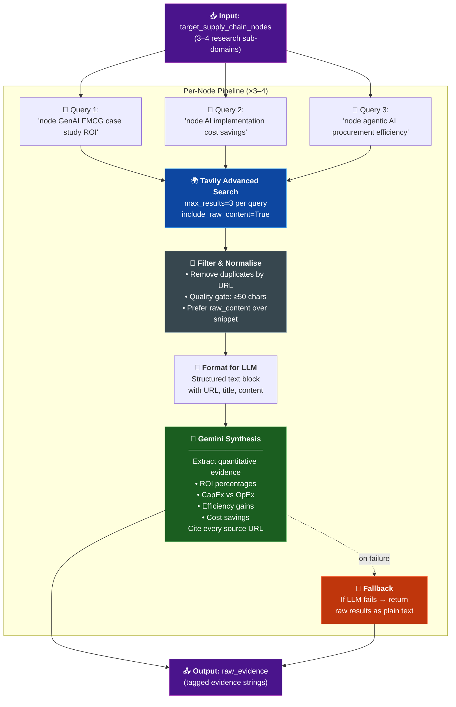
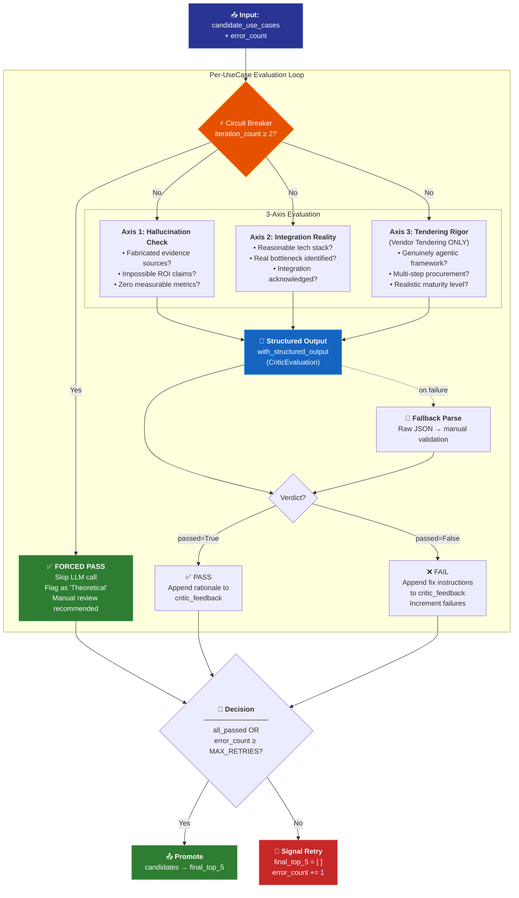
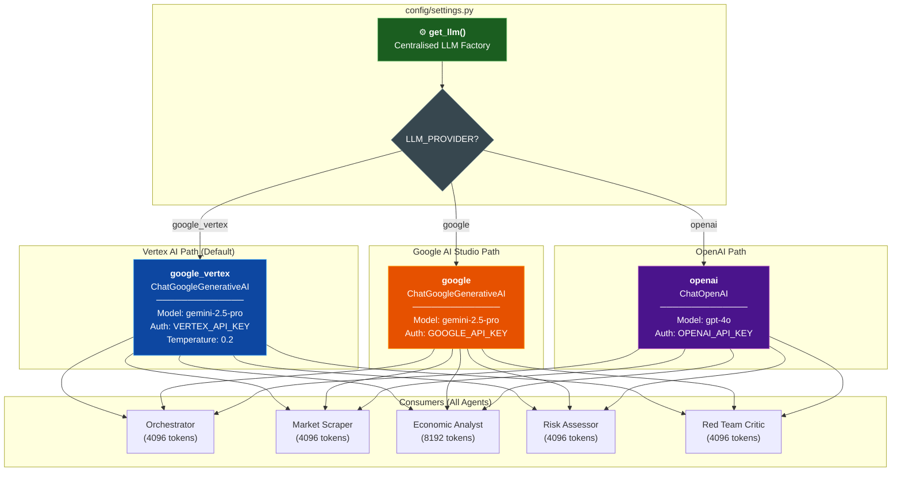

# Architecture and Data Flow

## Agent Architecture
The core of the system is built on a cyclic Directed Acyclic Graph (DAG), utilizing five specifically tailored agents. Each agent has dedicated component responsibilities:

1. **[Orchestrator](../src/agents/orchestrator.py)**: Acts as the central node managing the overall execution flow.
2. **[Market Scraper](../src/agents/market_scraper.py)**: Responsible for external data acquisition via search APIs.
3. **[Economic Analyst](../src/agents/economic_analyst.py)**: Processes raw data to extract specific microeconomic implications.
4. **[Risk Assessor](../src/agents/risk_assessor.py)**: Identifies integration hurdles, security implications, and enterprise constraints.
5. **[Red Team Critic](../src/agents/red_team_critic.py)**: Serves as the adversarial check within the cyclic loop, actively hunting for unverified claims or hallucinated metrics.

---

## 1. High-Level System Architecture

The system is a multi-agent research pipeline built on **LangGraph**, orchestrated through a compiled state machine. All agents share a strict **Pydantic TypedDict** state contract and communicate via Gemini LLM calls with structured output enforcement.

---

## 2. LangGraph Pipeline Flow

This diagram shows the exact execution order of the compiled state machine, including the conditional reflection/retry loop after the Critic node.

---

## 3. State Data Flow Between Agents

Shows the exact state keys produced and consumed by each agent, illustrating the immutable, append-only state management pattern.

> *ⁱ = Used only on retry passes. ↻ = In-place enrichment of existing objects.*

---

## 4. Pydantic Data Model Hierarchy

The strict schema that enforces data contracts between agents at runtime.

---

## 5. Market Scraper — Search & Synthesis Pipeline

Details the two-stage pipeline executed per research node inside the Market Scraper.

---

## 6. Red Team Critic — Adversarial Evaluation & Retry Logic

The Critic's three-axis evaluation framework and the circuit-breaker mechanism that prevents infinite loops.

---

## 7. LLM Configuration & Provider Architecture

The centralised LLM factory supporting multiple providers with fallback chains.

---

## 8. Error Handling & Resilience Architecture

Shows the multi-layered error handling strategy across the pipeline.

```mermaid
flowchart TD
    subgraph "Layer 1: LLM Output Parsing"
        L1A["<b>Primary:</b> with_structured_output()<br/>Pydantic-validated JSON"]
        L1B["<b>Fallback:</b> Raw JSON parsing<br/>+ manual model_validate()"]
        L1C["<b>Last Resort:</b> Default values<br/>or conservative FAIL verdict"]
        L1A -.->|"ValidationError"| L1B
        L1B -.->|"JSONDecodeError"| L1C
    end

    subgraph "Layer 2: Search Resilience"
        L2A["<b>Tavily Search</b><br/>Exponential backoff<br/>max_retries=3"]
        L2B["<b>Quality Filter</b><br/>≥50 char gate<br/>URL deduplication"]
        L2C["<b>Fallback Evidence</b><br/>Raw results as plain text"]
        L2A --> L2B
        L2A -.->|"timeout / 429 / 503"| L2A
        L2B -.->|"LLM synthesis fails"| L2C
    end

    subgraph "Layer 3: Pipeline Circuit Breakers"
        L3A["<b>error_count Tracker</b><br/>Increments on any Critic failure batch"]
        L3B{"error_count ≥<br/>MAX_RETRIES (2)?"}
        L3C["<b>Force Promotion</b><br/>candidates → final_top_5<br/>Pipeline terminates"]
        L3D["<b>iteration_count</b><br/>Per UseCase (≥2 → force-pass)"]
        L3A --> L3B
        L3B -->|"Yes"| L3C
    end

    subgraph "Layer 4: Graceful Degradation"
        L4A["<b>Per-Node Isolation</b><br/>Scraper/Assessor/Critic errors<br/>on one UseCase don't block others"]
        L4B["<b>Mandatory Fail-safe</b><br/>Vendor Tendering use case<br/>injected if LLM omits it"]
        L4C["<b>Error Audit Trail</b><br/>All errors appended to<br/>GraphState.errors list"]
    end

    style L1A fill:#1565c0,stroke:#42a5f5,color:#fff
    style L1B fill:#e65100,stroke:#ff9800,color:#fff
    style L1C fill:#c62828,stroke:#ef5350,color:#fff
    style L3C fill:#c62828,stroke:#ef5350,color:#fff
    style L4B fill:#2e7d32,stroke:#66bb6a,color:#fff
```

---

## Memory and State Management
To prevent context collapse and state corruption across the 5-agent cyclic loop, the system manages state using a strict Pydantic `TypedDict` defined in **[GraphState](../src/state/graph_state.py)**.

We utilize the `.with_structured_output()` method to enforce a rigid data contract across all agent LLM calls. The state management system allows agents to append data immutably layer by layer. Furthermore, the system implements a strict `iteration_count` circuit breaker logic within the Critic. This prevents infinite API loop traps by force-passing stubborn use cases after a maximum number of retries, explicitly flagging them in the final output as "Theoretical". This guarantees that the pipeline will always resolve while still maintaining an auditable trail of the Critic's rejections.
